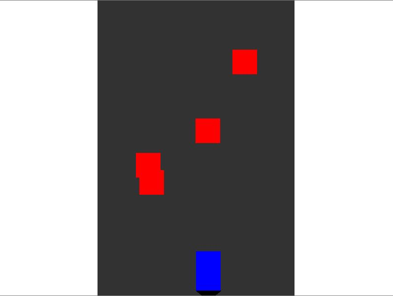

# Elevator Game

This is a Python-based simulation game developed using Pygame. The game simulates the operation of multiple elevators in a building, managing passengers with different priorities and behaviors.

## Features

- **Multiple Elevators**: The game simulates two elevators operating in a building with five floors.
- **Passenger Behavior**: Passengers have random weights, priorities (VIP and Regular), and patience levels.
- **Elevator Mechanics**: Elevators manage their speed, door operation, and handle maintenance scenarios.
- **Realistic Constraints**: Elevators have a maximum weight capacity, and overloads affect their performance.

## Installation

1. Make sure you have Python installed on your system.
2. Install the required dependencies:
    ```bash
    pip install pygame
    ```
3. Clone this repository and navigate to the project directory.

## How to Run

Run the game using the following command:
"python main.py"

## Controls 
- **Arrow Up/Down: **
- **Mouse Click: **
- **S Key: **

## Customization
You can modify various constants in the main.py file to adjust the game's behavior, such as:
- Number of floors (FLOOR_COUNT)
- Number of elevators (ELEVATOR_COUNT)
- Maximum elevator speed (MAX_SPEED)
- And more...

